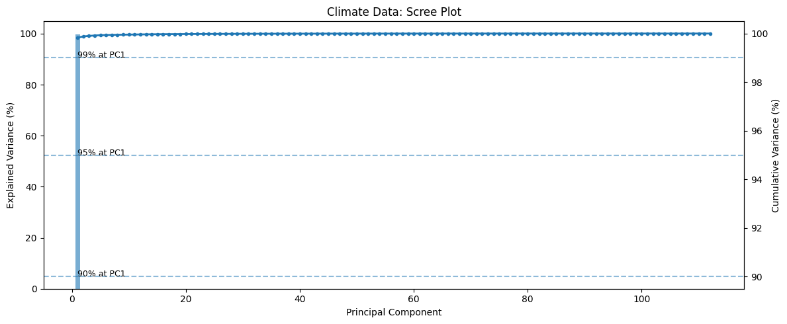
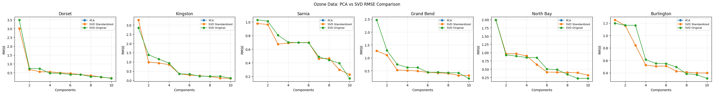

# Time-Series Analysis using PCA and SVD

### Dimensionality Reduction and Reconstruction of Climate & Air Pollution Data

## Overview

This project explores how **Principal Component Analysis (PCA)** and **Singular Value Decomposition (SVD)** can be used to understand, compress, and reconstruct long-term environmental time-series data.

Two real-world datasets are analyzed:

* Global land temperature trends (1901–2012)
* Ozone air pollution levels across Canadian stations (1995–2022)

The goal is to study how much information can be retained using fewer components and how reconstruction accuracy varies across datasets.

---

## Objectives

* Perform **dimensionality reduction** using PCA
* Analyze **variance explained** by principal components
* Reconstruct original signals using limited components
* Compare **PCA vs SVD** under different data conditions
* Evaluate reconstruction quality using **RMSE and residual error**

---

## Datasets

### 1. Global Temperature Dataset

* Source: Berkeley Earth
* Features: Yearly average temperature per country
* Shape: ~234 countries * 112 years

### 2. Ozone Air Pollution Dataset

* Source: Canadian monitoring stations
* Features: Annual ozone levels per station
* Shape: 18 stations * 28 years

---

## Methodology

### Data Processing

* Converted raw data into **time-series matrix format**
  * Rows -> Countries / Stations
  * Columns -> Years
* Removed missing values and ensured consistent time ranges
* Standardized features using `StandardScaler`

---

### PCA Workflow

* Computed covariance matrix
* Extracted eigenvalues and eigenvectors
* Sorted components by explained variance
* Generated scree plots
* Identified minimum components for **99.9% variance retention**

---

### Reconstruction

* Reconstructed time series using incremental components:
  * PC1
  * PC1–PC2
  * PC1–PC4
  * PC1–PC8
  * PC1–PC16
* Evaluated reconstruction quality using:
  * Residual error plots
  * Root Mean Square Error (RMSE)

---

### SVD Comparison

* Applied SVD in two ways:
  * On standardized data
  * On original (non-standardized) data
* Compared results against PCA:
  * Residual error
  * RMSE vs number of components

---

## Key Results

### Climate Data – Scree Plot


Only 3 components explain ~99.9% variance, indicating strong global structure.

### Ozone Data – RMSE Comparison


Ozone data requires significantly more components, showing weaker shared structure.

---

## Visualizations

The project includes:

* Scree plots (variance explained)
* Principal component time-series
* Reconstruction curves
* Residual error plots
* RMSE vs number of components

---

## Tech Stack

* Python
* NumPy
* Pandas
* Matplotlib
* Scikit-learn

---

## How to Run

```bash
# Clone repository
git clone https://github.com/sohenpatel22/Time-Series-Analysis-using-PCA-and-SVD.git
cd Time-Series-Analysis-using-PCA-and-SVD

# Install dependencies
pip install -r requirements.txt

# Run analysis
python src/run_climate_analysis.py
python src/run_ozone_analysis.py
```

---

## Project Structure

```
├── data/
│   ├── processed/
│   │   ├── climate_yearly.csv
│   │   └── ozone_yearly.csv
│   └── README.md
├── notebooks/
├── src/
│   ├── load_data.py
│   ├── preprocess.py
│   ├── pca_utils.py
│   ├── svd_utils.py
│   ├── plotting.py
│   ├── run_climate_analysis.py
│   └── run_ozone_analysis.py
├── outputs/
│   └── plots/
├── requirements.txt
└── README.md
```

---

## Limitations

* PCA assumes **linear relationships**
* Annual averaging removes seasonal patterns
* Dropping missing values may reduce dataset diversity
* Reconstruction accuracy ≠ predictive performance

---

## References

* PCA and SVD theoretical resources
* NumPy and Scikit-learn documentation

---

## Final Takeaway

This project shows that:

* Some real-world datasets (like global temperature) have strong low-dimensional structure
* Others (like ozone levels) are more complex and require more components
* Proper preprocessing (especially scaling) is critical for meaningful results

---

## Author

Sohen Azizuddin Patel

